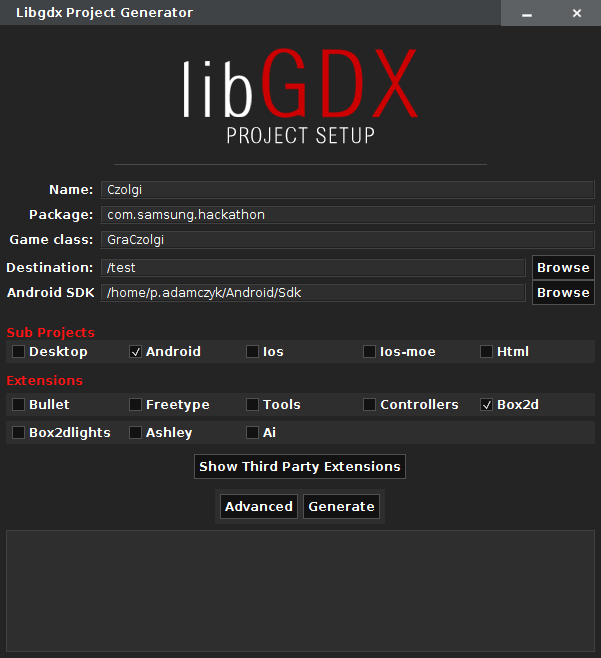
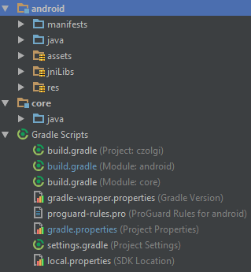

# Czołgi

Ten tutorial pozwoli wam stworzyć grę w Czołgi. Miłej zabawy. :)

# Stworzenie projektu

Rozpocznij przez pobranie [aplikacji](https://libgdx.badlogicgames.com/download.html?_mm=05AEcOVtTUfD), która w prosty sposob pozwoli na skonfigurowanie projektu z LibGDX oraz Android SDK.

W tej chwili nie będziemy zagłębiać się w szczegóły konfiguracji projektów na Androida, lecz opiszemy w skrócie strukturę projektu, którą otrzymacie zaraz po utworzeniu projektu.

Do stworzenia projektu wykorzystujemy narzędzie dostarczone przez twórców biblioteki libgdx, które po uruchomieniu wygląda tak:



W narzedziu zaznaczamy wszystkie niezbędne parametry takie jak
- nazwa,
- nazwa pakietu,
- nazwa głównej klasy w projekcie,
- katalog docelowy,
- ścieżkę do SDK Android,
- platformy na które jest przeznaczona gra
- dodatki


# Struktura projektu



Projekt składa się z dwóch modułów:
 * **core** - zawiera podstawowe klasy z logiką gry. W tym module implementujemy wszystkie algorytmy związane z grą.
 * **android** - zawiera wszystkie zasoby, które są używane w czasie gry. Moduł ten posiada również kod odpowiedzialny za inicjalizację i uruchomienie gry na Androidzie.

# Gra

Główna klasa gry to `GraCzolgi`. Dziedziczy ona po klasie `ApplicationAdapter`, która
dostarcza wszystkie potrzebna nam funkcje związane z cyklem życia naszej gry.
Są to:
 * ```create()``` - jest wywoływana na samym początku gry. W tym miejscu powinniśmy załadować wszystkie tekstury i inne obiekty z których zamierzamy korzystać w czasie gry.
 * ```render()``` - jest to główna pętla gry, gdyż funkcja jest wywoływana ciągle za każdym razem gdy trzeba narysować nową klatkę gry.
 * ```dispose()``` - ta funkcja jest wywoływana przy zamknięciu gry i służy do zwolnienia wszystkich zasobów, które były stworzone w trakcie gry.

## Mapa

## Czołg

## Pocisk


Pocisk jest reprezentacja pocisku strzelanego przez czołg.
Pocisk będzie ukazywany przez teksturę


zatem klasa `Pocisk` dziedziczy po klasie `Sprite`.
```
public class Czolg extends Sprite {

}
```

Wewnątrz mamy metode, która sprawdza czy kula trafiła w czołg:
```
    public boolean czyTrafilWCzolg(Czolg czolg) {
        return czolg.getBoundingRectangle().overlaps(getBoundingRectangle());
    }


```
oraz czy pocisk wyleciał poza obszar naszej gry:

```
    public boolean czyPozaEkranem() {
        return getX() > GraCzolgi.EKRAN_SZEROKOSC || getX() < 0 ||
                getY() > GraCzolgi.EKRAN_WYSOKOSC || getY() < 0;
    }

```

